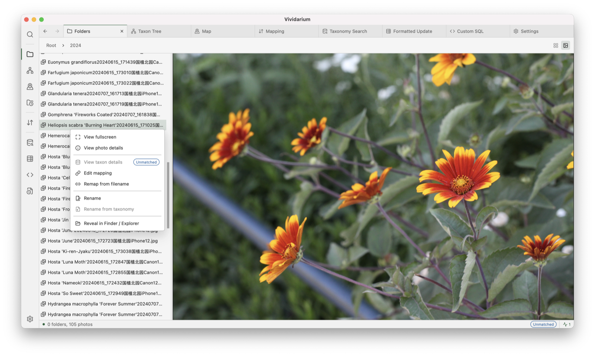
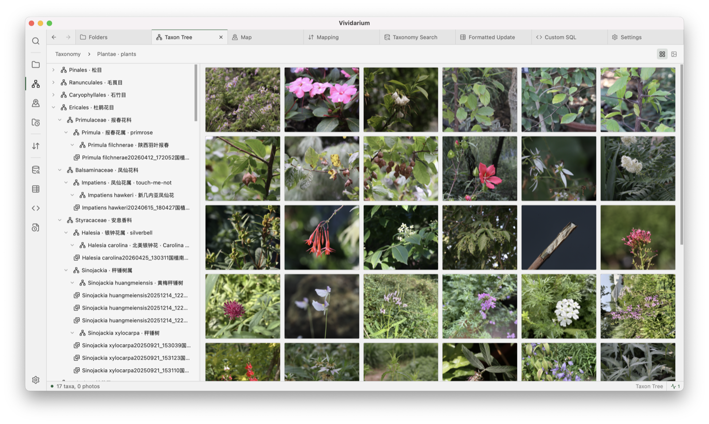
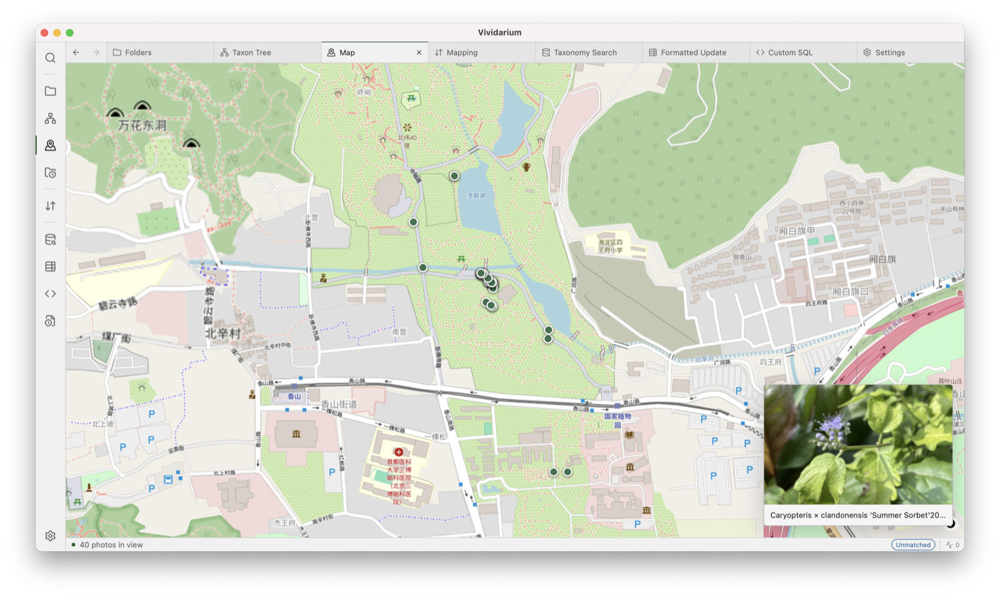
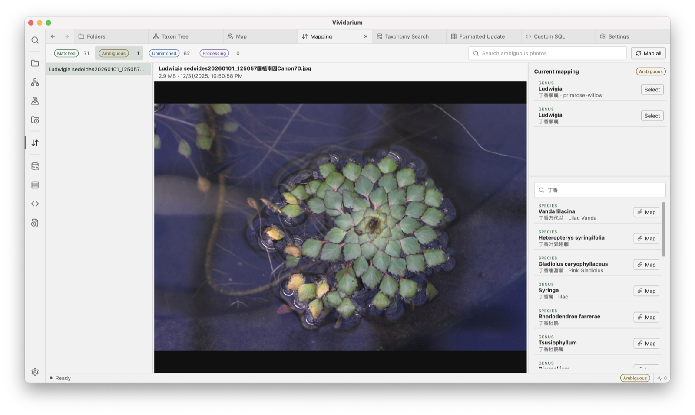
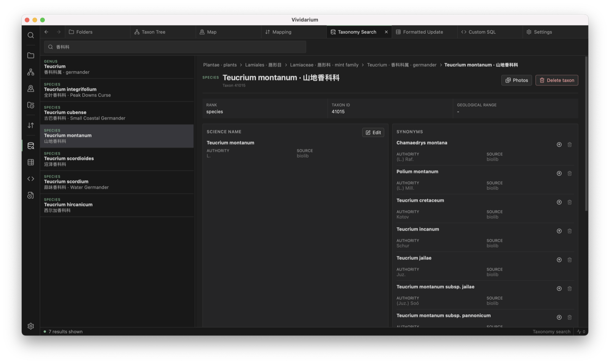
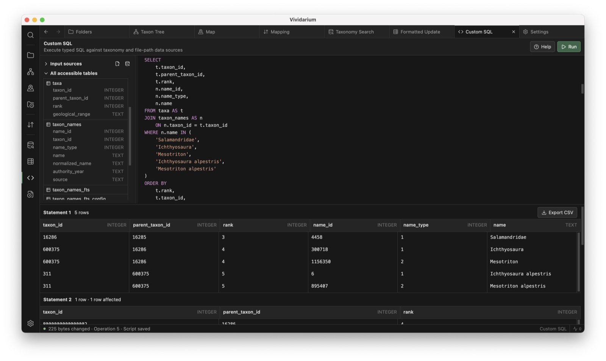
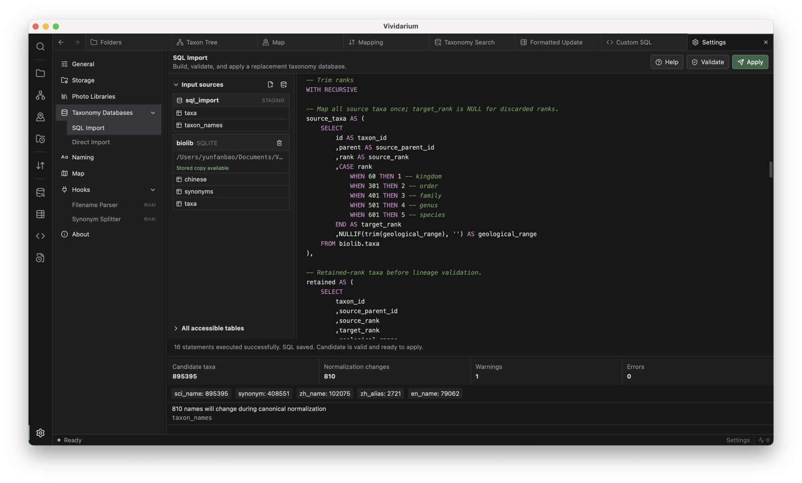
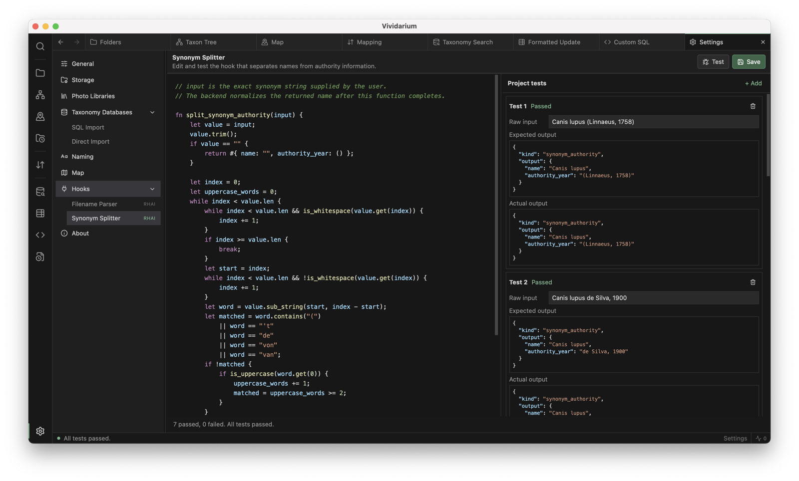

<div align="center">


# Vividarium

### A local-first desktop workbench for biological photo libraries and taxonomy

[](https://github.com/baoyunfan0101/Vividarium/releases)
[](https://github.com/baoyunfan0101/Vividarium/releases/latest)
[](https://github.com/baoyunfan0101/Vividarium/releases)
[](https://tauri.app/)
[](LICENSE)

[Download](https://github.com/baoyunfan0101/Vividarium/releases/latest) | [Changelog](CHANGELOG.md) | [Documentation](docs/README.md)

</div>

## Why Vividarium?

Biological photo collections often combine three different kinds of information: files on disk, taxonomy data, and names encoded in filenames. Keeping those sources aligned becomes difficult as a collection grows, taxonomy changes, or several photo libraries need to share one knowledge base.

Vividarium brings that work into one native desktop application:

- **Photo libraries** - register independent libraries, browse folders and thumbnails, inspect metadata, and keep original files local.
- **Automatic indexing** - opening an unindexed library starts background filesystem, metadata, and mapping stages while existing data and unrelated tabs remain available.
- **Taxonomy workbench** - search and navigate taxa, edit name groups, run formatted updates, or replace a taxonomy through SQL Import or Direct Import.
- **Photo-to-taxon mapping** - match configurable filename fields against scientific, Chinese, and English names, review ambiguous results, and override mappings explicitly.
- **Consistent rename tools** - rename one photo or a directory selection from accepted taxonomy names with audit history and rollback.
- **Large-library navigation** - cursor-paged lists, virtualized views, resizable workbenches, keyboard navigation, and map browsing for geotagged photos.
- **Local-first operation** - SQLite databases, thumbnails, metadata, and operation history remain on the user's computer.

## Product Tour

Explore the photo and mapping workflows in the light theme, then the taxonomy
and customization workbenches in the dark theme.

<table>
  <tr>
    <td width="50%" valign="top">
      <strong>Folders</strong> <em>- Light theme</em><br>
      Browse indexed photos, open the photo context menu, and inspect the full image.<br><br>
      <a href="assets/screenshots/folders-photo-view.png"></a>
    </td>
    <td width="50%" valign="top">
      <strong>Taxon Tree</strong> <em>- Light theme</em><br>
      Navigate photographed taxa alongside a virtual thumbnail grid.<br><br>
      <a href="assets/screenshots/taxon-tree-grid.png"></a>
    </td>
  </tr>
  <tr>
    <td width="50%" valign="top">
      <strong>Map</strong> <em>- Light theme</em><br>
      Browse geotagged photos on an interactive map with an image preview.<br><br>
      <a href="assets/screenshots/map.png"></a>
    </td>
    <td width="50%" valign="top">
      <strong>Mapping</strong> <em>- Light theme</em><br>
      Review ambiguous filename matches and map photos directly to taxa.<br><br>
      <a href="assets/screenshots/mapping-review.png"></a>
    </td>
  </tr>
  <tr>
    <td width="50%" valign="top">
      <strong>Taxonomy Search</strong> <em>- Dark theme</em><br>
      Search names, inspect the hierarchy, and maintain complete taxon records.<br><br>
      <a href="assets/screenshots/taxonomy-search.png"></a>
    </td>
    <td width="50%" valign="top">
      <strong>Custom SQL</strong> <em>- Dark theme</em><br>
      Query accessible taxonomy and file data with structured, exportable results.<br><br>
      <a href="assets/screenshots/custom-sql.png"></a>
    </td>
  </tr>
  <tr>
    <td width="50%" valign="top">
      <strong>SQL Import</strong> <em>- Dark theme</em><br>
      Build, validate, and apply a replacement taxonomy from staged SQL sources.<br><br>
      <a href="assets/screenshots/sql-import.png"></a>
    </td>
    <td width="50%" valign="top">
      <strong>Hooks</strong> <em>- Dark theme</em><br>
      Customize Rhai parsers and verify their behavior with project tests.<br><br>
      <a href="assets/screenshots/hooks-and-tests.png"></a>
    </td>
  </tr>
</table>

## Highlights

### Browse and inspect photos

- Folder tree, photographed taxon tree, global search, taxon Photo Sets, and MapLibre map.
- Synchronized list, thumbnail grid, and full-image selection.
- Copyable EXIF and file metadata, native file-manager actions, and shared photo context menus.

### Build and maintain taxonomy

- Scientific, synonym, Chinese, and English name groups with authority, source, and geological range metadata.
- Search by accepted names or aliases with autocomplete and hierarchy navigation.
- Preview-first formatted updates, prepared apply, configurable CSV delimiter, and concise rule help.
- Readable Custom SQL plus staged SQL Import and validated Direct Import workflows.

### Review every mutation

- Rename History and Taxonomy History with selection, formatted audit JSON, CSV export, replayable taxonomy input export, and rollback.
- Background-operation status for long-running imports, mapping, refresh, and update work.
- Tab-scoped status messages so completed work remains visible when returning to a tab.

## Download and Installation

Download the latest packages from [GitHub Releases](https://github.com/baoyunfan0101/Vividarium/releases/latest).

| Platform | Requirement | Package | First launch |
| --- | --- | --- | --- |
| macOS Apple Silicon | macOS 11 or newer | `Vividarium_<version>_aarch64.dmg` | Open Privacy and Security and allow Vividarium after the first blocked launch. |
| Windows x64 | Windows 10 or 11 | `Vividarium_<version>_x64-setup.exe` | Confirm the SmartScreen warning. WebView2 is installed if missing. |

Release packages do not require Python, Node.js, Rust, SQLite, or a separate database server on the destination computer. Current macOS and Windows packages are not notarized or signed with a paid platform certificate, so the operating system may request manual trust confirmation.

## Quick Start

1. Open Vividarium and create or register a Photo Library.
2. Open **Settings > Taxonomy Databases** and populate the taxonomy with SQL Import or a compatible Direct Import database.
3. Configure filename matching under **Settings > Naming**.
4. Let the first background index and mapping pass finish, then review the Mapping workspace. Reopening a library or using Refresh reconciles later filesystem changes.
5. Use Folders, Taxon Tree, Search, or Map to browse the indexed collection.

Vividarium does not copy or upload original photos while indexing. Filesystem and metadata work runs in bounded background batches, and the initial index does not pre-generate the library's thumbnails. Lists and grids load cursor pages on demand; thumbnails are created only near the visible area. Actions explicitly labeled Rename do rename files on disk and record the operation in Rename History.

## Taxonomy Data Sources

Vividarium does not bundle or redistribute a taxonomy dataset. You can build a knowledge base from your own licensed sources and transform it through SQL Import, or import a SQLite database that already follows the Vividarium taxonomy schema.

For a concrete data-acquisition reference, see [BioLib Peeker](https://github.com/baoyunfan0101/biolib-peeker). It is a separate personal project that crawls and organizes BioLib taxa and synonyms into source datasets. Its output is useful as an input reference, but it is **not** a ready-made Vividarium Direct Import database; adapt it through SQL Import or another schema conversion step first.

Always follow the source website's terms, licensing, rate limits, and redistribution rules. BioLib Peeker is not affiliated with or endorsed by BioLib, and neither project grants rights to third-party taxonomy data.

## Map Providers

OpenStreetMap is available without configuration. Tianditu can be selected under **Settings > Map** when OpenStreetMap tiles are unavailable. Tianditu requires a browser-side application token (`tk`); Vividarium stores it in local application metadata and masks it in the interface.

## Privacy and Storage

- Original photos remain in the selected Photo Library directories.
- Metadata, taxonomy, registered libraries, settings, and history are stored in local SQLite databases.
- Vividarium has no account system and no application cloud sync.
- Network access is used only for selected map tiles, update checks, and links that the user explicitly opens.

Vividarium 3.0.0 databases use schema `2`. Vividarium 3.1.0 automatically
upgrades supported schema-2 metadata, taxonomy, and Photo Library databases to
schema `3`. The upgrade is forward-only: databases opened by 3.1.0 are not
supported by Vividarium 3.0.0.

<details>
<summary><strong>Architecture</strong></summary>

Vividarium uses React and TypeScript for the desktop UI, Tauri 2 for the native adapter, and a Tauri-independent Rust core for SQLite and domain services.

```text
React feature domains
        |
Typed frontend API wrappers
        |
Tauri command adapters
        |
vividarium-core domain services
        |
Local metadata, taxonomy, and photo-library SQLite databases
```

See [Architecture](docs/ARCHITECTURE.md), [Desktop Frontend](docs/DESKTOP.md), and the [Backend API index](docs/README.md).

</details>

<details>
<summary><strong>Development</strong></summary>

### Prerequisites

- Rust 1.85 or newer
- Node.js 24 or newer and npm
- Tauri 2 platform prerequisites
- Tauri CLI 2

### Run locally

```bash
cargo install tauri-cli --version "^2.0" --locked
cd apps/desktop
npm ci
cargo tauri dev
```

Development builds store application data in the repository `data/` directory. Set `VIVIDARIUM_DATA_DIR` to use another location.

### Verify

```bash
cargo test --workspace --locked

cd apps/desktop
npm run test:desktop
npm run build
```

### Build release packages

```bash
./scripts/build-macos.sh
```

On Windows PowerShell:

```powershell
.\scripts\build-windows.ps1
```

See [Building and Releasing](docs/BUILDING.md) for signing variables, artifact locations, and the complete release procedure.

</details>

## Contributing

Bug reports, documentation corrections, and focused pull requests are welcome. Please run the Rust workspace tests, desktop tests, and production frontend build before submitting a change.

## License

[MIT](LICENSE) Copyright (c) Yunfan Bao.
